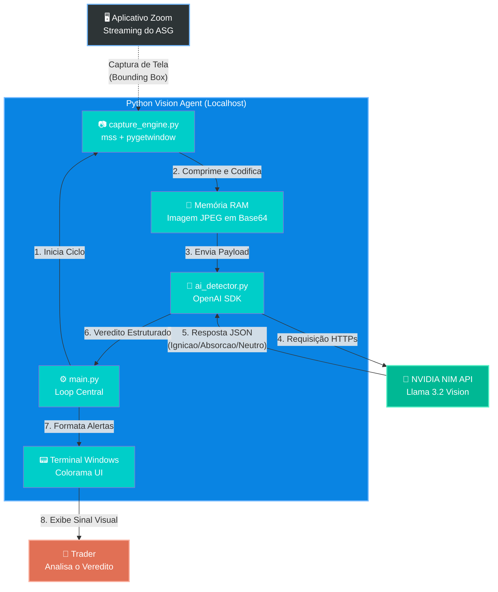

# Arquitetura do Agente de Visão ASG

Abaixo está o mapeamento visual (fluxograma) de como os componentes de hardware e software interagem em tempo real, sem necessidade de tocar na infraestrutura de roteamento de ordens do MetaTrader 5.

## Diagrama de Fluxo de Dados (Dataflow)

O ciclo abaixo ocorre a cada N segundos (configurável no `main.py`), garantindo que o seu console do Windows espelhe a leitura institucional em tempo real.

---

## Detalhamento dos Componentes

### 1. `capture_engine.py` (Os Olhos)
* **Objetivo:** Isolar o ruído visual e capturar apenas a informação vital.
* **Mecanismo:** Usa a biblioteca `pygetwindow` para "perseguir" a janela do Zoom dinamicamente pela tela. Uma vez que as coordenadas (X, Y) são encontradas, injeta esses dados na biblioteca `mss`.
* **Vantagem Competitiva:** Ao contrário de prints normais do Windows que gastam milissegundos escrevendo no HD, o `mss` joga os pixels direto na Memória RAM (buffer `io.BytesIO()`) eliminando o gargalo de disco I/O.

### 2. `ai_detector.py` (O Cérebro)
* **Objetivo:** Interpretar a Física Microestrutural extraída no *Playbook*.
* **Mecanismo:** Usa a SDK nativa da OpenAI apontando para a infraestrutura gratuita da **NVIDIA NIM**. 
* **Vantagem Competitiva:** O modelo *Llama 3.2 Vision Instruct (11b ou 90b)* é treinado especificamente para obedecer a *system prompts* rigorosos. O nosso prompt engessa o modelo para cuspir estritamente JSON contendo as chaves `Maker`, `Micro`, `Vela`, `Padrao` e `Veredito`, impossibilitando que a IA perca tempo escrevendo "explicações prolixas" (zero alucinação poética, apenas dados de fluxo).

### 3. `main.py` (O Sistema Nervoso)
* **Objetivo:** Orquestrar o ritmo e traduzir o JSON para um ambiente de stress militar (Day Trade).
* **Mecanismo:** Roda um `while True` respeitando a janela de *rate limit* da API. Limpa o console (`cls`) a cada batida.
* **Vantagem Competitiva:** Usa a biblioteca `colorama` para engatilhar reflexos condicionados no trader: 
  * Mensagens Neutras são silenciadas (amarelo).
  * **Armadilhas de Absorção** piscam em VERMELHO.
  * **Sinais de Ignição** piscam em VERDE.
  * O tempo total de latência (desde o click invisível na tela até a resposta da NVIDIA) é contabilizado na tela para você monitorar gargalos de rede.

### 4. Lógica de Resiliência (Tolerância a Falhas)
Em ambientes de Day Trade de alta frequência, o script **não pode** morrer se houver uma oscilação na rede ou se o usuário minimizar a janela sem querer. Foram implementadas 3 camadas de resiliência:
* **Window Fallback (Capture Engine):** Se o pygetwindow não achar a janela do Zoom ou ela for minimizada (resolução 0x0), o script não quebra. Ele entra num loop de 3 tentativas (	ime.sleep(0.5)) e, se falhar, chaveia automaticamente para a captura integral do Monitor Primário como medida de emergência.
* **Exponential Backoff (API LLM):** Requisições para o endpoint da NVIDIA NIM podem sofrer rate-limiting (HTTP 429) ou timeouts. O i_detector.py engloba a requisição HTTP num loop MAX_RETRIES = 3 com backoff exponencial (espera 1s, depois 2s, depois falha elegante). O modelo foi engessado com 	imeout=10 para nunca ficar pendurado infinitamente numa porta de rede morta.
* **Parser Fallback (JSON):** Modelos abertos (Llama 3) ocasionalmente alucinam *markdowns* mesmo instruídos a cuspir JSON puro. Um parser ultra-rígido intercepta blocos  `json , quebras de linha 
 e lida com o JSONDecodeError, impedindo que um caractere inválido derrube o loop central do main.py.
